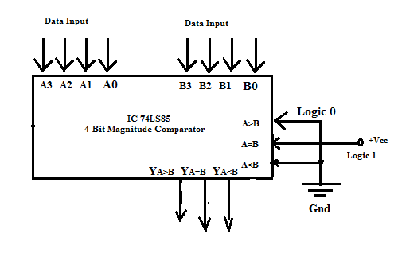
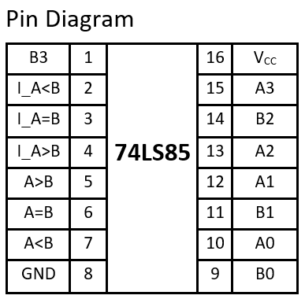
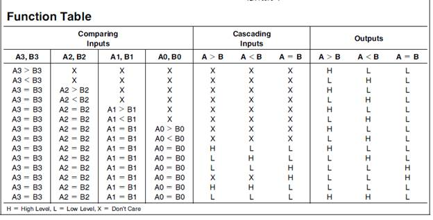
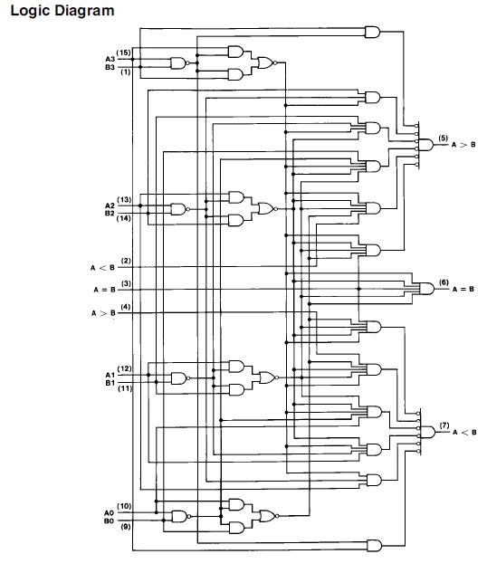

IC 74LS85 is a four-bit magnitude comparator that compares Binary Numbers. It checks whether a 4-bit binary number A3 A2 A1 A0 is greater than, less than or equal to another 4-bit number B3 B2 B1 B0. The IC has two sets of four bit inputs to be compared and also has three cascade inputs A &gt; B, A = B and A &lt; B and produces three outputs A &gt; B, A = B and A &lt; B. These devices are fully expandable to any number of bits without external gates. 

<b>Diagram:</b> 

  

  

  
 

  

#### Numerical:

The Comparator compare the number bit by bit from MSB to LSB. 
The function table of 4-bit comparator is:

<table border="1" cellspacing="0" class="MsoTableGrid">
	<thead>
		<tr>
			<th colspan="4" rowspan="1" scope="col">Comparing Input</th>
			<th colspan="3" rowspan="1" scope="col">Output</th>
		</tr>
	</thead>
	<tbody>
		<tr>
			<th>A3, B3</th>
			<th>A2, B2</th>
			<th>A1, B1</th>
			<th>A0, B0</th>
			<th>A &gt; B</th>
			<th>A = B</th>
			<th>A &lt; B</th>
		</tr>
		<tr>
			<td>A3 &gt; B3</td>
			<td>X</td>
			<td>X</td>
			<td>X</td>
			<td>1</td>
			<td>0</td>
			<td>0</td>
		</tr>
		<tr>
			<td>A3 &lt; B3</td>
			<td>X</td>
			<td>X</td>
			<td>X</td>
			<td>0</td>
			<td>0</td>
			<td>1</td>
		</tr>
		<tr>
			<td>A3 = B3</td>
			<td>A2 &gt; B2</td>
			<td>X</td>
			<td>X</td>
			<td>1</td>
			<td>0</td>
			<td>0</td>
		</tr>
		<tr>
			<td>A3 = B3</td>
			<td>A2 &lt; B2</td>
			<td>X</td>
			<td>X</td>
			<td>0</td>
			<td>0</td>
			<td>1</td>
		</tr>
		<tr>
			<td>A3 = B3</td>
			<td>A2 = B2</td>
			<td>A1 &gt; B1</td>
			<td>X</td>
			<td>1</td>
			<td>0</td>
			<td>0</td>
		</tr>
		<tr>
			<td>A3 = B3</td>
			<td>A2 = B2</td>
			<td>A1 &lt; B1</td>
			<td>X</td>
			<td>0</td>
			<td>0</td>
			<td>1</td>
		</tr>
		<tr>
			<td>A3 = B3</td>
			<td>A2 = B2</td>
			<td>A1 = B1</td>
			<td>A0 &gt; B0</td>
			<td>1</td>
			<td>0</td>
			<td>0</td>
		</tr>
		<tr>
			<td>A3 = B3</td>
			<td>A2 = B2</td>
			<td>A1 = B1</td>
			<td>A0 &lt; B0</td>
			<td>0</td>
			<td>0</td>
			<td>1</td>
		</tr>
		<tr>
			<td>A3 = B3</td>
			<td>A2 = B2</td>
			<td>A1 = B1</td>
			<td>A0 = B0</td>
			<td>0</td>
			<td>1</td>
			<td>0</td>
		</tr>
	</tbody>
</table>

 
 

Example: 
<ol>
<li>
A = 0, B = 0 
&nbsp;&nbsp;&nbsp;A = 0 (Decimal)&nbsp;&nbsp;&nbsp; 0000 (Binary) 
&nbsp;&nbsp;&nbsp;B = 0 (Decimal)&nbsp;&nbsp;&nbsp; 0000 (Binary) 
  Ans: 
  	<table border="1" cellspacing="0" class="MsoTableGrid">
		<tr>
			<th>A&gt;B</th>
			<th>A=B</th>
			<th>A&lt;B</th>
		</tr>
		<tr>
			<td>Low</td>
			<td>High</td>
			<td>Low</td>
		</tr>
	</table>
	 
	 
</li>
<li>
A = 0, B = 2 
&nbsp;&nbsp;&nbsp;A = 0 (Decimal)&nbsp;&nbsp;&nbsp; 0000 (Binary) 
&nbsp;&nbsp;&nbsp;B = 2 (Decimal)&nbsp;&nbsp;&nbsp; 0010 (Binary) 
  Ans: 
  	<table border="1" cellspacing="0" class="MsoTableGrid">
		<tr>
			<th>A&gt;B</th>
			<th>A=B</th>
			<th>A&lt;B</th>
		</tr>
		<tr>
			<td>Low</td>
			<td>Low</td>
			<td>High</td>
		</tr>
	</table>
	 
	 
</li>
<li>
A = 4, B = 2 
&nbsp;&nbsp;&nbsp;A = 4 (Decimal)&nbsp;&nbsp;&nbsp; 0100 (Binary) 
&nbsp;&nbsp;&nbsp;B = 2 (Decimal)&nbsp;&nbsp;&nbsp; 0010 (Binary) 
  Ans: 
  	<table border="1" cellspacing="0" class="MsoTableGrid">
		<tr>
			<th>A&gt;B</th>
			<th>A=B</th>
			<th>A&lt;B</th>
		</tr>
		<tr>
			<td>High</td>
			<td>Low</td>
			<td>Low</td>
		</tr>
	</table>
</li>
</ol>